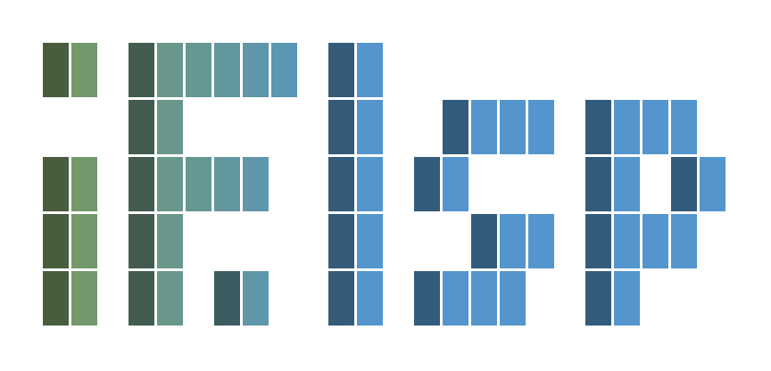

<p align="center">
  <picture>
    <source media="(prefers-color-scheme: dark)" srcset="./assets/logo-dark.svg">
    
  </picture>
</p>

<p align="center">
  A unified LSP UI layer for Neovim — hover, diagnostics, code actions,<br>
  signature help, inlay hints and scope breadcrumbs in one place.
</p>

## Requirements

- Neovim >= 0.11 (`client:request`, `vim.diagnostic.jump`, `vim.hl`)
- A configured LSP client
- [nvim-web-devicons](https://github.com/nvim-tree/nvim-web-devicons)

## Install

```lua
{
  "if-then-nvim/if.lsp",
  main = "if.lsp",
  dependencies = { "nvim-tree/nvim-web-devicons" },
  event = "LspAttach",
  opts = {},
}
```

`main` is not optional. Without it lazy.nvim infers `if` from the
directory layout, and if.nvim ships `lua/if/init.lua`.

## Usage

`setup()` registers a global `IfLsp`. Modules load on first access, and
`require("if.lsp")` gives you the same table.

```lua
IfLsp.hover()
IfLsp.definition()
IfLsp.code_action()
IfLsp.signature_help()
IfLsp.rename()

IfLsp.diagnostic.goto_next()
IfLsp.diagnostic.goto_prev()
IfLsp.diagnostic.open_float()

IfLsp.inlay_hint.toggle(bufnr)   -- also enable / disable
IfLsp.scope.toggle()
```

```lua
vim.keymap.set("n", "K", IfLsp.hover)
vim.keymap.set("n", "gd", IfLsp.definition)
vim.keymap.set("n", "<Leader>ca", IfLsp.code_action)
vim.keymap.set("n", "<Leader>rn", IfLsp.rename)
vim.keymap.set("n", "]d", IfLsp.diagnostic.goto_next)
vim.keymap.set("n", "[d", IfLsp.diagnostic.goto_prev)
```

`:IfLsp` runs hover; `:IfLsp {hover,definition,code_action,rename,signature_help,inlay_hint,scope}`
reaches the rest.

## Configuration

Every option and its default is in
[config.lua](lua/if/lsp/config.lua). Icons live under `glyph`, and each
feature has its own table:

```lua
opts = {
  hover = { show_kind_prefix = false },
  rename = { preview = true, diff_context = 3 },
  scope = { biscuit = { enabled = true, visible_mode = "hover" } },
  inlay_hint = { param_icon = true, object_threshold = 3 },
  signature_help = { auto = false },
  diagnostic = { footer = { enabled = true } },
  glyph = { hover_kind = { alias = "A" } },
}
```

`rename` asks the server what the edit would be and shows it as a diff —
how many places, in how many files — before anything is written. Set
`preview = false` to skip straight to applying it.

Hover responses that carry a kind prefix — `(alias)`, `(method)` — get an
icon in the sign column and their own highlight, with the prefix text
concealed unless `show_kind_prefix` is set.

## Highlights

Every `IfLsp*` group links to a built-in by default and can be overridden
through the `highlights` option. The full list is in
[highlights.lua](lua/if/lsp/ui/highlights.lua).

## Development

```sh
make test     # plenary suite
make lint     # stylua --check + selene
make format
make check    # lint + test
```
